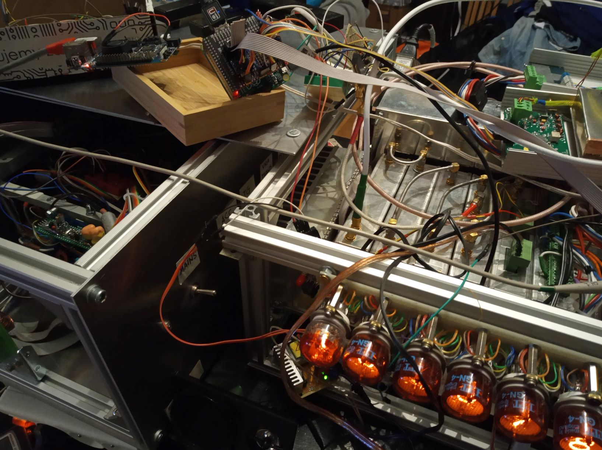

# trx_plaszczka
software part of my homebrew transceiver project (Płaszczka == Stingray)

receiver part bases on CDG2000 design with massive improvements by Martein PA3AKE \
VFO: AD9954, anticipating a bugfix for a faster chip from Analog Devices ;} \
BFO: custom design auxiliary PLL from Silabs
main clock source based on great designs from Miro OM3LZ and PA3AKE \
display: steampunk red glowing Nixies \
powered by eight cores of BananaPi M3 \
PA: all-mosfet 100W, a clone of https://openhpsdr.org/wiki/index.php?title=MUNIN
